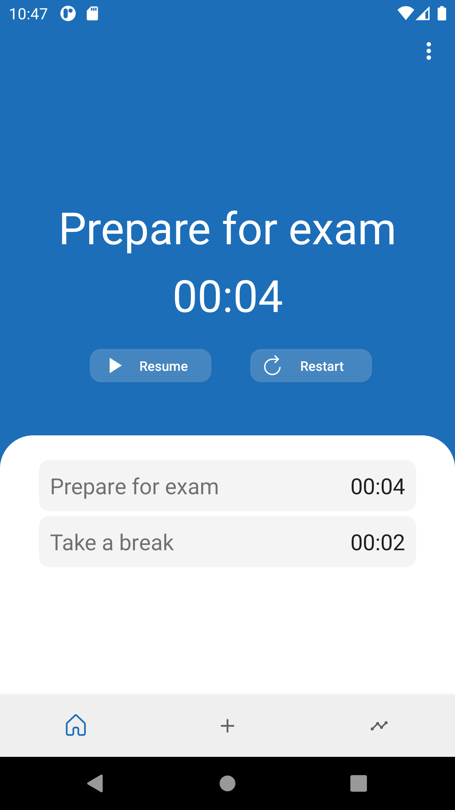
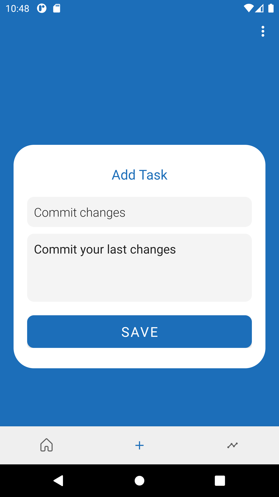
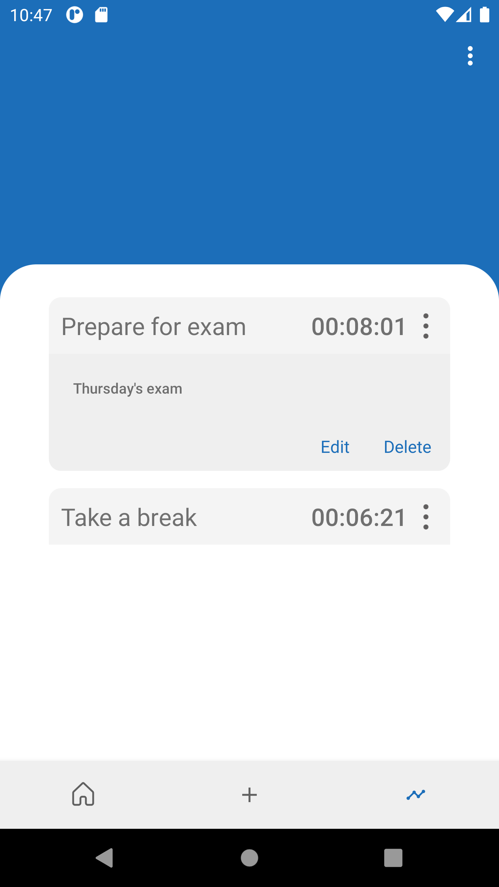

# Task Timer
### Shurikens hard work 🌀💪🏼

Task Timer is an android app that helps you to keep a track of how much time you spend on each task.
Create a task, press it to start the timer, press it again to stop the timer, and choose whether you want to resume or restart the task.
You can find all of your tasks in the statistics tab, and you can edit/delete them easily without affecting the time you spend on them.

### v 1.0

Useful links:

Task Timer prototype: https://www.figma.com/file/W5OqrFQAg3GHzWehjT7ubC/Untitled?node-id=0%3A1

Task Timer demo: https://youtu.be/Bz8cLr8ngg4

### v 1.1
Small changes to the user interface

